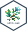

<!-- README.md is generated from README.Rmd. Please edit that file -->

# sdtm.oak <a href="https://pharmaverse.github.io/sdtm.oak/"></a>

<!-- badges: start -->

[](https://CRAN.R-project.org/package=sdtm.oak)

<!-- badges: end -->

An EDC (Electronic Data Capture systems) and Data Standard agnostic
solution that enables the pharmaceutical programming community to
develop CDISC (Clinical Data Interchange Standards Consortium) SDTM
(Study Data Tabulation Model) datasets in R. The reusable algorithms
concept in 'sdtm.oak' provides a framework for modular programming. We
plan to develop a code generation feature based on a standardized SDTM
specification format, which has the potential to automate the creation
of SDTM datasets.

## Installation

The package is available from CRAN and can be installed with:

``` r
install.packages("sdtm.oak")
```

You can install the development version of 'sdtm.oak' from
[GitHub](https://github.com/pharmaverse/sdtm.oak/) with:

``` r
# install.packages("remotes")
remotes::install_github("pharmaverse/sdtm.oak")
```

## Challenges with SDTM at the Industry Level

-   Raw Data Structure: Data from different EDC systems come in varying
    structures, with different variable names, dataset names, etc.

-   Varying Data Collection Standards: Despite the availability of CDASH
    (Clinical Data Acquisition Standards Harmonization), pharmaceutical
    companies still create different eCRFs using CDASH standards.

Due to the differences in raw data structures and data collection
standards, it may seem impossible to develop a common approach for
programming SDTM datasets.

## GOAL

'sdtm.oak' aims to address this issue by providing an EDC-agnostic,
standards-agnostic solution. It is an open-source R package that offers
a framework for the modular programming of SDTM in R. With future
releases; we plan to develop a code generation feature based on a
standardized SDTM specification format, which has the potential to
automate the creation of SDTM datasets.

## Scope

Our goal is to use 'sdtm.oak' to program most of the domains specified
in SDTMIG (Study Data Tabulation Model Implementation Guide: Human
Clinical Trials) and SDTMIG-AP (Study Data Tabulation Model
Implementation Guide: Associated Persons). This R package is based on
the core concept of `algorithms`, implemented as functions capable of
carrying out the SDTM mappings for any domains listed in the CDISC
SDTMIG and across different versions of SDTM IGs. The design of these
functions allows users to specify a raw dataset and a variable name(s)
as parameters, making it EDC (Electronic Data Capture) agnostic. As long
as the raw dataset and variable name(s) exist, 'sdtm.oak' will execute
the SDTM mapping using the selected function. It’s important to note
that 'sdtm.oak' may not handle sponsor-specific details related to
managing metadata for LAB tests, unit conversions, and coding
information, as many companies have unique business processes.

## This Release

With the V0.2.0 release of 'sdtm.oak' users can now efficiently
create the DM domain and various SDTM domains, encompassing Findings,
Events, Findings About, and Intervention classes. However, the V0.2.0 release does NOT cover Trial Design Domains, SV (Subject Visits), SE (Subject Elements), RELREC (Related Records), Associated Person domains, or the EPOCH Variable across all domains.

## Road Map

Subsequent Releases: We are planning to develop the below features in
the subsequent releases.\
- Metadata driven code generation based on the standardized SDTM
specification.\
- Functions required to program the Domains SV (Subject Visits), SE (Subject Elements) and the EPOCH Variable.\
- Functions to derive standard units and results based on metadata. 
- Additional features to be developed based on the user feedback.

## References and Documentation

-   Please go to
    [Algorithms](https://pharmaverse.github.io/sdtm.oak/articles/algorithms.html)
    article to learn about Algorithms.
-   Please go to [Create Events
    Domain](https://pharmaverse.github.io/sdtm.oak/articles/interventions_domain.html)
    to learn about step by step process to create an Events domain.
-   Please go to [Create Findings
    Domain](https://pharmaverse.github.io/sdtm.oak/articles/findings_domain.html)
    to learn about step by step process to create a Findings domain.
-   Please go to [Path to
    Automation](https://pharmaverse.github.io/sdtm.oak/articles/study_sdtm_spec.html)
    to learn about how the foundational release sets up the stage for
    automation.
-   Please watch this YouTube video to learn about using the package
    [YouTube
    Video](https://www.youtube.com/watch?v=H0FdhG9_ttU&list=PLMtxz1fUYA5C67SvhSCINluOV2EmyjKql&index=3&ab_channel=RinPharma%5D)
-   RinPharma Virtual workshop
    [slides](https://pharmaverse.github.io/rinpharma-2024-SDTM-workshop/)

## Feedback

We ask users to follow the mentioned approach and try 'sdtm.oak' to map
any SDTM domains supported in this release. Users can also utilize the
test data in the package to become familiar with the concepts before
attempting on their own data. Please get in touch with us using one of
the recommended approaches listed below:

-   [Slack](https://oakgarden.slack.com/)
-   [GitHub](https://github.com/pharmaverse/sdtm.oak/issues)

## Acknowledgments

We thank the contributors and authors of the package. We also thank the
CDISC COSA for sponsoring the 'sdtm.oak'. Additionally, we would like to
sincerely thank the volunteers from Roche, Pfizer, GSK, Vertex, and
Merck for their valuable input as integral members of the CDISC COSA -
OAK leadership team.
