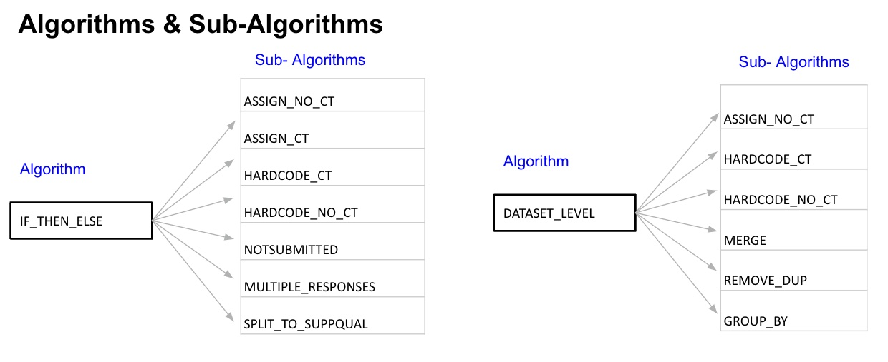

## Core Concept

SDTM mappings are defined as algorithms that transform the collected
(eCRF, eDT) source data into the target SDTM data model. Mapping
algorithms are the backbone of the {sdtm.oak} - SDTM data transformation
engine.

**Key Points:**

-   Algorithms can be re-used across multiple SDTM domains.

-   Algorithms are pre-specified for data collection standards in MDR
    (if applicable) to facilitate automation.
    
-   Programming language agnostic - this concept does not rely on a
    specific programming language for implementation. The {sdtm.oak} team
    implemented them as R functions.

Here is an example of reusing an algorithm across multiple domains,
variables, and also to a non-standard

{width="600px"}

## List of Algorithms

This release of {sdtm.oak} supports the following algorithms: assign_no_ct, assign_ct, hardcode_no_ct, hardcode_ct, assign_datetime, condition_add. Rest of the algorithms will be developed in the subsequent releases.

The following table provides a brief description of each algorithm.

```{r echo = FALSE, results = "asis"}
library(knitr)
algorithms <- data.frame(
  `Algorithm Name` = c(
    "assign_no_ct",
    "assign_ct",
    "assign_datetime",
    "hardcode_ct",
    "hardcode_no_ct",
    "condition_add",
    "ae_aerel",
    "dataset_level",
    "not_submitted",
    "relrec",
    "multiple_responses",
    "split_to_suppqual",
    "remove_dup",
    "group_by",
    "merge_datasets"
  ),
  `Description` = c(
    paste(
      "One-to-one mapping between the raw source and a target",
      "SDTM variable that has no controlled terminology restrictions.",
      "Just a simple assignment",
      "statement."
    ),
    paste(
      "One-to-one mapping between the raw source and a target ",
      "SDTM variable that is subject to controlled terminology restrictions.",
      "A simple assign statement and applying controlled terminology.",
      "This will be used only if the SDTM variable has an associated",
      "controlled terminology."
    ),
    paste(
      "One-to-one mapping between the raw source and a target that involves ",
      "mapping a Date or time or datetime component. This mapping algorithm",
      "also takes care of handling unknown dates and converting them into.",
      "ISO8601 format."
    ),
    paste(
      "Mapping a hardcoded value to a target SDTM variable that is subject to terminology restrictions.",
      "This will be used only if the SDTM variable has an associated",
      "controlled terminology."
    ),
    paste(
      "Mapping a hardcoded value to a target SDTM variable that has no terminology restrictions."
    ),
    paste(
      "Algorithm that is used to filter the source data and/or target domain",
      "based on a condition. The mapping will be applied only if the condition is met.",
      "The filter can be applied either at the source dataset or at target dataset or both.",
      " This algorithm has to be used in conjunction with other algorithms, that is if the",
      " condition is met perform the mapping using algorithms like assign_ct,",
      "assign_no_ct, hardcode_ct, hardcode_no_ct, assign_datetime."
    ),
    paste(
      "Algorithm that is currently unique to AE.AEREL,",
      "particularly when more than one drug is used in the study.<br>  If any collected study drug",
      "causalities are 'Yes' then AE.AEREL is Y.  <br>If all collected study",
      "drug causalities are 'NA' then AE.AEREL is NA.  <br>If no study drug",
      "causalities are 'Yes' but there is at least one causality of 'No'",
      "then AE.AEREL is N.  <br>Individual study drug causality responses are",
      "stored in AERELn in SUPPAE."
    ),
    paste(
      "Indicates a dataset-level mapping.  These mappings will",
      "be applied to all SDTM records created from that source.",
      "Also called an eCRF-level mappings in eCRF and dataset-level",
      "mappings in eDT"
    ),
    paste(
      "Instruction that `{sdtm.oak}` should not map the collected item to SDTM at all."
    ),
    paste(
      "Associate two domains based on the variables in each domain and how those are related.",
      "Specifies the name of two domains that are related via RELREC."
    ),
    paste(
      "Consolidate the responses from more than one source variable into one target variable.",
      "Used when multiple responses may be given for a single SDTM column.",
      "`{sdtm.oak}` will populate all target variable(s) after determining the number of responses provided."
    ),
    paste(
      "Consolidates the responses from more than one",
      "source variable into more than one target variable",
      "(always a suppqual/non-standard variable).",
      "There is no 'parent' target variable that is populated with 'MULTIPLE'."
    ),
    paste(
      "Sub-algorithm at the domain level that indicates some source records may",
      "be removed during the `{sdtm.oak}` mapping process if determined to be duplicate records."
    ),
    paste(
      "Sub-algorithm used at the domain level to group source records",
      "before mapping to SDTM.  This is used in the event we need to collapse data",
      "collected across multiple rows into one row in SDTM but it is not a simple",
      "un-duplication effort.  For example, the way infusion study drug",
      "administration data requires us to create 1 SDTM record in EC from 1 or more sources",
      "records. When there is more than one source record,",
      "we need to take the earliest collected infusion start date (for ECSTDTC) and",
      "the latest collected infusion end date within an eCRF instance."
    ),
    paste(
      "To indicate a join condition with a secondary source or multiple sources.",
      "Merges are expressed at the domain level only",
      "(not at data point or variable level).",
      "This is a sub-algorithm and can only be used with algorithm DATASET_LEVEL."
    )
  ),
  `Example` = c(
    paste(
      "MH.MHTERM<br>",
      "AE.AETERM"
    ),
    paste("VS.VSPOS<br>", "VS.VSLAT"),
    paste("MH.MHSTDTC<br>", "AE.AEENDTC"),
    paste(
      "MH.MHPRESP = 'Y'<br>",
      "<br>VS.VSTEST = 'Systolic Blood Pressure'<br>",
      "<br>VS.VSORRESU = 'mmHg'<br>"
    ),
    paste(
      "FA.FASCAT = 'COVID-19 PROBABLE CASE'<br>",
      "<br>CM.CMTRT = 'FLUIDS'"
    ),
    paste(
      "If If MDPRIOR == 1 then CM.CMSTRTPT = 'BEFORE'.<br>",
      "<br>VS.VSMETHOD when VSTESTCD = 'TEMP'<br>",
      "<br>If collected value in raw variable DOS is numeric then CM.CMDOSE<br>",
      "<br>If collected value in raw variable MOD is different to CMTRT then map to CM.CMMODIFY"
    ),
    paste("For AE.AEREL and AERELn in SUPPAE"),
    paste(
      "VS = 'Vital Signs'<br>",
      "<br>MH.MHCAT = 'PROSTATE CANCER HISTORY'<br>"
    ),
    paste(""),
    paste("BE record related to BS record via RELREC"),
    paste(
      "AE.AERELNST/ AERELNSn IN SUPPAE<br> <br>",
      "<br>DM.RACE, if only one value is selected.<br>",
      "DM.RACE = MULTIPLE, if more than one value is selected.<br>",
      "RACEn in SUPPDM where n = 1 to N selected values"
    ),
    paste(
      "If both Filipino and Samoan are checked,",
      "CRACE1 will be 'FILIPINO' and CRACE2 will be 'SAMOAN'.<br>",
      "If only Chinese is checked, CRACE1 will be 'CHINESE'."
    ),
    paste("Remove duplicates on the Vital signs raw dataset based on subject number"),
    paste("EC = 'Exposure as Collected'"),
    paste(
      "Merge AE raw dataset with SAE based on Subject number."
    )
  ), stringsAsFactors = TRUE
)
knitr::kable(algorithms)
```

## Sub-algorithms

{sdtm.oak} supports two levels for defining algorithms. For example, there
are some SDTM mappings where a certain action has to be taken only when
a condition is met. In such cases, the primary algorithm checks for the
condition, and the sub-algorithm executes the mappings when the
condition is met.

Currently, sub-algorithms must be provided for this main algorithms.

-   condition_add
-   dataset_level

Some algorithms can be interchangeably used as algorithms and as
sub-algorithms as seen below (not an exhaustive list)

{width="650px"}

The permutation & combination of algorithms & sub-algorithms creates
endless possibilities to accommodate different types of mappings.
