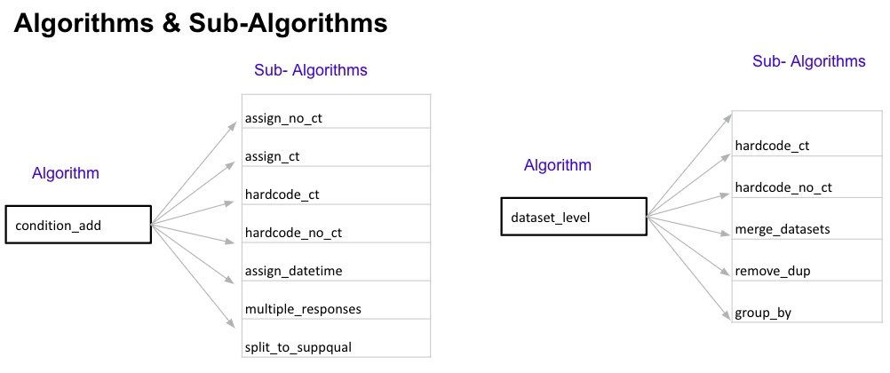

## Core Concept

SDTM mappings are defined as algorithms that transform the collected
(eCRF, eDT) source data into the target SDTM data model. Mapping
algorithms are the backbone of the sdtm.oak - SDTM data transformation
engine.

**Key Points:**

-   Algorithms can be re-used across multiple SDTM domains.

-   Algorithms are pre-specified for data collection standards in MDR
    (if applicable)
    
-   Programming language agnostic - this concept does not rely on a
    specific programming language for implementation. The OAK team
    implemented them as R functions.

Here is an example of reusing an algorithm across multiple domains,
variables, and also to a non-standard

{width="600px"}

## List of Algorithms

```{r echo = FALSE, results = "asis"}
library(knitr)
algorithms <- data.frame(
  `Algorithm Name` = c(
    "ASSIGN_NO_CT",
    "ASSIGN_CT",
    "AE_AEREL",
    "HARDCODE_CT",
    "HARDCODE_NO_CT",
    "DATASET_LEVEL",
    "NOTSUBMITTED",
    "IF_THEN_ELSE",
    "MERGE",
    "RELREC",
    "MULTIPLE_RESPONSES",
    "SPLIT_TO_SUPPQUAL",
    "REMOVE_DUP",
    "GROUP_BY"
  ),
  `Description` = c(
    paste(
      "One-to-one mapping between the raw source and a target",
      "SDTM variable that has no controlled terminology restrictions.",
      "Just a simple assignment",
      "statement. This algorithm will also handle the concatenation of",
      "multiple items into a target SDTM variable."
    ),
    paste(
      "One-to-one mapping between the raw source and a target ",
      "SDTM variable that is subject to controlled terminology restrictions.",
      "A simple assign statement and applying controlled terminology.",
      "This will be used only if the SDTM variable has an associated",
      "controlled terminology."
    ),
    paste(
      "Algorithm that is currently unique to AE.AEREL,",
      "particularly when more than one drug is used in the study.<br>  If any collected study drug",
      "causalities are 'Yes' then AE.AEREL is Y.  <br>If all collected study",
      "drug causalities are 'NA' then AE.AEREL is NA.  <br>If no study drug",
      "causalities are 'Yes' but there is at least one causality of 'No'",
      "then AE.AEREL is N.  <br>Individual study drug causality responses are",
      "stored in AERELn in SUPPAE."
    ),
    paste(
      "Mapping a hardcoded value to a target SDTM variable that is subject to terminology restrictions.",
      "This will be used only if the SDTM variable has an associated",
      "controlled terminology."
    ),
    paste(
      "Mapping a hardcoded value to a target SDTM variable that has no terminology restrictions."
    ),
    paste(
      "Indicates a dataset-level mapping.  These mappings will",
      "be applied to all SDTM records created from that source.",
      "Also called a eCRF-level mappings in eCRF and dataset-level",
      "mappings in eDT"
    ),
    paste(
      "Instruction that `sdtm.oak` should not map the collected item to SDTM at all."
    ),
    paste(
      "Represents the If then else statement. This can be an if statement",
      "with no else or with the else condition. This algorithm will be",
      "used for the annotations where a condition has to be evaluated",
      "before a mapping is performed. A sub-algorithm is required. If the",
      "condition resolves to `TRUE`, the sub-algorithm will be executed."
    ),
    paste(
      "To indicate a join condition with a secondary source or multiple sources.",
      "Merges are expressed at the domain level only",
      "(not at data point or variable level).",
      "This is a sub-algorithm and can only be used with algorithm DATASET_LEVEL."
    ),
    paste(
      "Associate two domains based on the variables in each domain and how those are related.",
      "Specifies the name of two domains that are related via RELREC."
    ),
    paste(
      "Consolidate the responses from more than one source variable into one target variable.",
      "Used when multiple responses may be given for a single SDTM column.",
      "`sdtm.oak` will populate all target variable(s) after determining the number of responses provided."
    ),
    paste(
      "Consolidates the responses from more than one",
      "source variable into more than one target variable",
      "(always a suppqual/non-standard variable).",
      "There is no 'parent' target variable that is populated with 'MULTIPLE'."
    ),
    paste(
      "Sub-algorithm at the domain level that indicates some source records may",
      "be removed during the `sdtm.oak` mapping process if determined to be duplicate records."
    ),
    paste(
      "Sub-algorithm used at the domain level to group source records",
      "before mapping to SDTM.  This is used in the event we need to collapse data",
      "collected across multiple rows into one row in SDTM but it is not a simple",
      "un-duplication effort.  For example, the way infusion study drug",
      "administration data requires us to create 1 SDTM record in EC from 1 or more source",
      "records in the mixed log form. When there is more than one source record,",
      "we need to take the earliest collected infusion start date (for ECSTDTC) and",
      "the latest collected infusion end date within an eCRF instance."
    )
  ),
  `Example` = c(
    paste(
      "MH.MHTERM<br>",
      "VS.VSDTC<br>",
      "MH.MHTERM = [LNGCAHX1.HSTYP] || ' ' || 'NON-METASTATIC LUNG CANCER'<br>",
      "CM.CMINDC = [MD9.MDCIND] || ' ' || [MD9.MDCINDSP]"
    ),
    paste("VS.VSPOS<br>", "VS.VSLAT"),
    paste("For AE.AEREL and AERELn in SUPPAE"),
    paste(
      "MH.MHPRESP = 'Y'<br>",
      "VS.VSTEST = 'Systolic Blood Pressure'<br>",
      "VS.VSORRESU = 'mmHg'<br>"
    ),
    paste(
      "FA.FASCAT = 'COVID-19 PROBABLE CASE'<br>",
      "CM.CMTRT = 'FLUIDS'"
    ),
    paste(
      "VS = 'Vital Signs'<br>",
      "MH.MHCAT = 'PROSTATE CANCER HISTORY'<br>"
    ),
    paste(""),
    paste(
      "If 'Ongoing' then MH.MHENRTPT = 'ONGOING' <br> Else MH.MHENRTPT = 'BEFORE'<br> <br>",
      "If [HX1.STATUS] is present then MH.MHENTPT = 'FIRST DOSE OF STUDY DRUG'<br> <br>",
      "If checked then MH.MHSTTPT = 'SCREENING' <br> Else NOT SUBMITTED <br><br>",
      "VS.VSMETHOD when VS.VSTESTCD = 'TEMP'",
      "(Though the annotation text does not have the If condition,",
      "we need to map VSMETHOD only if the VSTESTCD is TEMP. The IF_THEN_ELSE will be",
      "used as the Algorithm for such cases even the 'If' condition is not explicitly",
      "defined in the annotation text)"
    ),
    paste("AE = 'Adverse Events' on the early phase SAE eCRF"),
    paste("BE record related to BS record via RELREC"),
    paste(
      "AE.AERELNST/ AERELNSn IN SUPPAE<br> <br>",
      "DM.RACE, if only one value is selected.<br>",
      "DM.RACE = MULTIPLE, if more than one value is selected.<br>",
      "RACEn in SUPPDM where n = 1 to N selected values"
    ),
    paste(
      "If both Filipino and Samoan are checked,",
      "CRACE1 will be 'FILIPINO' and CRACE2 will be 'SAMOAN'.<br>",
      "If only Chinese is checked, CRACE1 will be 'CHINESE'."
    ),
    paste("AE = 'Adverse Events' on early phase SAE form"),
    paste("EC = 'Exposure as Collected'")
  ),
  stringsAsFactors = TRUE
)
knitr::kable(algorithms)
```

## Sub-algorithms

sdtm.oak supports two levels for defining algorithms. For example, there
are some SDTM mappings where a certain action has to be taken only when
a condition is met. In such cases, the primary algorithm checks for the
condition, and the sub-algorithm executes the mappings when the
condition is met.

Currently, sub-algorithms must be provided for these main algorithms.

-   IF_THEN_ELSE
-   DATASET_LEVEL

Algorithms can be interchangeably used as algorithms and as
sub-algorithms as seen below (not an exhaustive list)

{width="650px"}

The permutation & combination of algorithms & sub-algorithms creates
endless possibilities to accommodate different types of mappings.
